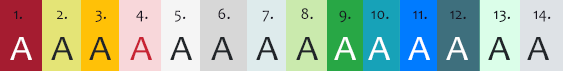

# MCZbase Developer’s Guide

The key words "MUST", "MUST NOT", "REQUIRED", "SHALL", "SHALL NOT", "SHOULD", "SHOULD NOT", "RECOMMENDED", "MAY", and "OPTIONAL" in this document are to be interpreted as described in [RFC 2119](https://tools.ietf.org/html/rfc2119).

<!--ts-->
* [Files-and-Directories](#Files-and-Directories)
	* [File-Naming](#File-Naming)
	* [Core-Pages-For-an-Object](#Core-Pages-For-an-Object)
	* [Directory-Organization](#Directory-Organization)
	* [External-Dependencies](#External-Dependencies)
	* [Page-identification-and-rights](#Page-identification-and-rights)
* [Coding-Conventions](#Coding-Conventions)
	* [Line-Endings](#Line-Endings)
	* [Indentation](#Indentation)
	* [Variable-Naming](#Variable-Naming)
	* [Operators](#Operators)
	* [Scopes](#Scopes)
	* [Functions](#Functions)
	* [Embeded-SQL](#Embeded-SQL)
	* [Javascript-Organization.](#Javascript-Organization.)
	* [Javascript-References-to-DOM](#Javascript-References-to-DOM)
	* [CSS](#CSS)
	* [Semantic-Tags](#Semantic-Tags)
* [Behaviors](#Behaviors)
	* [Relational-Integrity](#Relational-Integrity)
	* [Search/Results](#Search/Results)
	* [Saving-Changes](#Saving-Changes)
	* [Ajax-Feedback](#Ajax-Feedback)
* [Styling-Pages](#Styling-Pages)
	* [Types-of-Pages](#Types-of-Pages)
		* [Edit-Pages](#Edit-Pages)
		* [Search-Pages](#Search-Pages)
	* [Section Headings](#Section-Headings)
	* [Responsive-Styles](#Responsive-Styles)
	* [Whitespace](#Whitespace)
	* [Colors](#Colors)
	* [Typography](#Typography)
	* [Buttons](#Buttons)
	* [Content-Boxes](#Content-Boxes)
	* [Dialog-Boxes](#Dialog-Boxes)
	* [Alert-Boxes](#Alert-Boxes)
	* [Agent Pick Fields](#Agent-Pick-Fields)
* [Accessibility:](#Accessibility:)
	* [Use-Semantic-tags](#Use-Semantic-tags)
	* [Use-Labels-and-aria-properties-for-controls](#Use-Labels-and-aria-properties-for-controls)
	* [Skip-to-main-content-link](#Skip-to-main-content-link)
	* [Tabindex=0-[need-to-check-this]-](#Tabindex=0-[need-to-check-this]-)
<!--te-->

## Files and Directories

### File Naming

File names that represent editable objects SHOULD be singular nouns starting with an upper case letter: /transactions/Loan.cfm

Filenames for search and results pages for objects SHOULD be plural nouns starting with an upper case letter: /Transactions.cfm

File names that represent actions that can be taken with objects SHOULD be a lower case verb composed with noun starting with an upper case letter: /taxonomy/showTaxonomy.cfm

In general, use filenames and organization of directories such that redesign files can coexist with the files they will replace. For example, /shared/ replaces /includes/, and /Taxa.cfm replaces /Taxonomy.cfm (while TaxonomyDetails.cfm and other top level Taxonomy... pages move to /taxonomy/ as showTaxonomy.cfm etc.)

### Core Pages For an Object

For a given database concept (e.g. Taxonomy, Publication, Media), there SHOULD, in general, be three cfm files representing 4 pages:

(1) Search with Results page – a search form with a grid that ajax loads and displays the search results in tabular form, often access is allowed for role=public. These forms support an http-get API where providing the page with query parameters and the parameter ''execute=true ''will cause the search form to be filled in and the search to execute, so that other pages may directly link to search results.

(2) Details page – read only details of a specific record, often access is allowed for role=public. The details page may be the target of a redirect in the reqest object/guid API managed by missing.cfm (e.g. /guid/, /name/, etc).   These pages should be named with a lowercase verb show e.g. /taxonomy/showTaxonomy.cfm.

(3) Edit and Create pages – contains forms to create a new record and to edit an existing record, access usually controlled to a role=manage\_x.   If multiple create/replace/update actions are carried out by a single file it SHOULD be named with just the upper case noun, e.g. /taxonomy/Taxonomy.cfm, however, if the file carries out only a single action, it SHOULD be composed with a lower case verb for that action e.g. /foo/editFoo.cfm.   

### Directory Organization

.cfc component files SHOULD be in a component/ directory.

.cfc custom tag files MUST be in /CustomTags/

widely reused cold fusion, javascript, and css files that we have written SHOULD be in /shared/

	/shared/
	/shared/js/
	/shared/css/

Included libraries (jquery, etc), MUST be inside /lib/

Accompany top level pages about objects (nouns, in upper case), with a lower case directory name to support specific components used in the rendering and editing of that object.

	Taxa.cfm (search with results page (plural) role=public)
	taxonomy/
	taxonomy/Taxonomy.cfm (taxonomy editor (singular), role=manage\_taxonomy, create and edit functionality).
	taxonomy/showTaxonomy.cfm (display taxonomy details (verbSingularNoun) role=public).
	taxonomy/js/taxonomy.js (supporting javascript files).
	taxonomy/component/search.cfc (backing methods for /Taxa.cfm search role=public).
	taxonomy/component/functions.cfc (other backing methods particular to taxa, backing functions for create/edit, role=manage\_taxonomy).

Place javascript functions that will be widely used outside their concept in /shared/, e.g. /shared/js/vocabularies.js for ajax lookups of controlled vocabulary terms. If a javascript function will be used outside of its concept, place it in a file in /shared/js/ and include this file in /shared/\_header.cfm. If a javascript function is only used within a concept, place it in a file in /{concept}/js/, include this file in /shared/\_header.cfm, but in a section that checks for the /concept/ path in the request (or in rare cases, where the code isn’t reused include directly from a .cfm file, or more likely place inline in that file).

### External Dependencies

Avoid external dependencies whenever possible. Included libraries MUST be loaded from copies stored in /lib/ rather than from external IRIs.

### Page identification and rights

At the top of each new page include the following block:

	<!--
	{filename}.{extension}

	Copyright 2021 President and Fellows of Harvard College

	Licensed under the Apache License, Version 2.0 (the "License");
	you may not use this file except in compliance with the License.
	You may obtain a copy of the License at

    	http://www.apache.org/licenses/LICENSE-2.0

	Unless required by applicable law or agreed to in writing, software
	distributed under the License is distributed on an "AS IS" BASIS,
	WITHOUT WARRANTIES OR CONDITIONS OF ANY KIND, either express or implied.
	See the License for the specific language governing permissions and
	limitations under the License.

	-->

On pages modified from existing MCZbase code, use these copyright statements instead:

	Copyright 2008-2017 Contributors to Arctos
	Copyright 2008-2020 President and Fellows of Harvard College

This block MAY be followed by a brief comment about intended function of the page.

## Coding Conventions

### Line Endings

Files MUST use **unix** line endings. Set your editing environment to do this automatically. Exceptions to this rule are .cfr report files, which MUST retain the line endings produced by the ColdFusion report builder, .png files, and files from external libraries placed in /lib/, which SHOULD retain their original line endings as provided by their source.

On windows computers you MUST NOT commit files which have had the line endings set to CRLF (Windows) to be compatible.

To identify files which need line ending conversion (typical of files copied over from the master branch into redesign, use:

`   egrep -l -R $'\r'\$ * | grep -v "^lib/" | grep -v "`\(.png\|.cfr\)`$"`

To convert files to unix line endings use:

`   dos2unix filename.cfm`

### Indentation

Indent each level of control nesting with **one tab** character. Indentation MUST use tabs.

Set your editing environment to use tabs for indentation. For display you can set your editing environment to display (but not convert) the tabs as either two or three spaces (1 tab = 4 spaces in Dreamweaver)

	<cfif action EQ “foo”>
		<cfif case EQ 1>
			<cfset>
		<cfelse>
			<cfset>
		</cfif>
	</cfif>

When nesting html or javascript or sql within coldfusion, indentation SHOULD start at the current level of indentation and indent for each level of nesting, regardless of the language involved.

	<cfif>	[coldfusion]
		<cfset>
		
[html]
			<h2></h2>
			
		

	</cfif>

Nest <cftry><cfcatch> blocks at the same level of indentation.

	<ctry>
		do stuff
	<cfcatch>
		handle exception
	</cfcatch>
	</cftry>

### Variable Naming

For variables declared in coldfusion or javascript that are not references to fields in the database, use camel case: localVariableName

For variables, html form element names and ids that map one to one onto a database field, use the name of the database field in all lower case: higher\_geography, (Principle: A reference to a field name is consistent across the application stack, it doesn’t have one name at one level of the stack and a different name at another level of the stack).

For IDs of DOM elements such as `
` tags in html that are to be referred to in javascript, use camel case: id=”theIdOfThisDiv”

In general, use long descriptive names for variables. Exception: Loop counters can use single lower case letters, in particular i or j. Avoid using q for the name of a query, except in very small function calls where the query will be operated on and referenced only within a few lines of the query.

### Operators

Place coldfusion operators in upper case.

	<cfif foo EQ bar>

Beware of logic errors created by using = instead of == to test for equality in javascript.

	if (foo=1) {    // error for test foo==1   (or foo===1, depending).
		// assignment of 1 to foo is always true
	} else {
		// this block is never reached
	}

Use spaces around operators when needed for clarity.

### Scopes

Except for placing a value in pageTitle for \_header.cfm, avoid using the request scope to pass parameters between coldfusion files.

	<cfset pageTitle = "Search Taxonomy">
	<cfinclude template = "/shared/_header.cfm">

Avoid:

	<cfset someParameter = "#retrievedValue#">
	<cfinclude template = "someTemplateThatUsesSomeParameter.cfm">

Pass variables explicitly to .cfc methods, and declare those variables explicitly using cfargument.

### Functions

Documentation for functions in both javascript or colfusion SHOULD be provided with a comment in javadoc format. Use @param, @return, and @see as needed.

	/** Function confirmDialog creates a simple confirm dialog with OK and cancel buttons,
	 * it creates a new div, types it as a jquery-ui modal dialog and displays it, invokes the
	 * specified callback function when OK is pressed.
	 *
	 * @param dialogText the text to place in the dialog.
	 * @prarm dialogTitle for the dialog header.
	 * @param okFunction callback function to invoke upon a press of the OK button.
	 */
	function confirmDialog(dialogText, dialogTitle, okFunction) {
		.....
	}

### Embeded SQL

Embedded SQL *'MUST **always use** <cfqueryparam>*' for parameters in all queries, no exceptions. User provided content MUST NOT be passed to the database except through a <cfqueryparam>.

Queries MUST be created inside a <cfquery> block. Queries MUST NOT be constructed as a text string that is then passed to a cfquery.

If needed, embed cfif statements and logic inside the <cfquery> block

Use upper case for SQL reserved words.

In general, begin each SQL clause on a new line, and indent for readability.

	<cfquery>
		SELECT fields FROM table
		WHERE
			field = ‘1’
			<cfif case EQ ‘x’>
				otherfield = <cfsqlparam value=”#providedValue#” cfsqltype=”CF_SQL_VARCHAR’>
			</cfif>
		ORDER BY otherfield
	</cfquery>

When declaring a result within each named query, use the name of the query with \_result appended.

	<cfquery name=”getCounts” .... result=”getCounts_result”>

### Javascript Organization.

Include short javascript function invocations in onClick elements of button and other html tags rather than binding them to clickEvents. (This practice makes generalization harder, but makes following the sequence of events from an event easier to trace out).

In general, embed `
	</cfoutput>

### Javascript References to DOM

Whenever possible, pass the ID values of elements in the DOM that are reference in javascript or coldfusion functions as parameters to the ajax function calls and then on to downstream handlers rather than embedding them as magic names downstream.

Given: 

	
 
 

Use (passing reference to id of div in function call):

	

Not (hard coding div id):

	

### CSS

Whenever possible, use Bootstrap classes instead of directly using css styles.

Use `<h1 class=”h3”>` **not** `<h1 style=”font-size: medium;”>`

See: [Styling Pages](#styling-pages) for details on which bootstrap classes to use where.

Avoid using inline styling whenever possible, except in early development and testing.

Place styles in external stylesheet documents instead of including them in .cfm files.

Styles that can be reused across all pages should be in /shared/styles.css.

Styles that are only used for a particular narrow solution related to one concept should be in an external style sheet file in the directory for includes for that concept.

Layout blocks in the stylesheet files with the selector on one line then an indented block of the style declarations, one per line. Place multiple values for the same property on the same line.

	.indent {
		text-indent: -2em;
		padding-left: 2em;
	}

### Semantic Tags

MCZbase pages use HTML semantic tags, `<main>` and `<section>` will used most frequently and on most pages.

* header, used inside /shared/\_header.cfm
* nav, used inside /shared/\_header.cfm
* main, use once on all pages which include /shared/\_header.cfm
* section, include, and repeat, when needed on pages
* article, use rarely
* aside, use rarely
* footer, used inside /shared/\_footer.cfm

Use the following semantic tags to organize the body of the page:

	<main class=”container” id=”content”>
		<section class=”row” >
			Main form or page content
		</section>
		<section class=”row” >
			Additional forms or content
		</section>
	</main>

A section MUST NOT declare a role=”region”. Main MUST NOT declare a role=”main”.

For Ajax feedback, use `<output>`

	<output id=”submitFeedback”>&nbsp;</output>

Use html semantic tags instead of role properties whenever possible.

Every coldfusion page that includes /shared/\_header.cfm MUST have one and only one <main> tag, and this tag MUST have the id of content. <main id=”content”> identifies the main content when it is an edit page and there is only one main content. The id=”content” MUST be provided in every page used to support the link, which is always present in the header to the “skip to main content”.  A section MUST NOT declare a role="main".

See accessibility and style section of this document for addition guidance.

## Behaviors

### Relational Integrity

Relational integrity MUST be enforced at the database level. Do not rely on the coldfusion or javascript layers to enforce database integrity. Provide primary key, not null, foreign key, and similar constraints in the DDL for schema objects.

Enforcement of required fields MUST be provided through not null constraints on fields, and SHOULD also use required constraints on html input elements and coldfusion cffunction cfattributes to handle user errors gracefully.

### Search/Results

MCZbase uses a model where a search form is at the top of a page and search results are loaded by Ajax into a jqxgrid below. These pages MUST support an API that allows the entire search form to be populated with url parameters, with the option to include an execute=true parameter in the url. When the execute=true parameter is present, on page loading, the search form mustMUST be filled in with the provided parameters and the search executed.

### Saving Changes

Edit pages in MCZbase SHOULD save changes to data via ajax posts from a save button to a backing cfcomponent cffunction method, with reloads of relevant parts of the page, rather than posting a form to reload the entire page.

New record pages in MCZbase SHOULD save changes by posting the new record form to a save handler, which then produces or redirects to the edit page for the newly created record.

### Ajax Feedback

Provide a marker to indicate that content is expected to be loaded by ajax when a page loads.

	<output id=”getsReplacedOnPageLoad”> Loading stuff...  </output>

**Provide a consistent spinner that ajax is happening.**

Use this pattern for areas that are to have content loaded by ajax on page load: 

    
 
        
 Loading...

    

WARNING: The spinner is deceptive, it implies that an action is ongoing, if this area remains spinning it is likely that javascript is broken and nothing is happening.

## Styling Pages 

**This Section In Progress**

### Types of Pages

There are a handful of page types from which we can generalize styles: search pages with results, edit forms with grouped related elements (e.g., edit taxonomy), edit pages with separate related elements (e.g., edit loans), create and clone pages, and show pages (e.g., showTaxonomy.cfm).

The full page search with results uses `
` but all the other pages use `<main class=”container”>`. The results should always use `
' .

The pages use the form fields data-entry-select, data-entry-input, and data-entry-prepend-select among others. These are custom fields that are smaller than the smallest fields of Bootstrap v4.5.

The only form that uses the bootstrap fields is the account profile page.

#### Edit Pages

Header and footer are included as includes.  Content between these includes on edit record pages SHOULD be structured with: 

	<main class=”container py-3” id=”content” >
		<section class=”row border rounded my-2”>
			<h1 class=”h2”>Title of Page </h1>
			<form class=”col-12” name=”” id=”” method=”” action=””>
`  	        	... edit form for concept of page, e.g. loan ...`
				... end section with Save/Delete buttons ...`
			</form>
		</section>
		<section class=”row”>
			
...
`           ... related concepts, e.g. shipments for loans...`
		</section>
	</main>

See: (??)Edit loans on Transactions.cfm(??) to see how to how two boxes of content side-by-side. Essentially, you want to put a class=“row” in a div or section around a col-{n} div or form.

	<section class="row px-0">
		<form  name="Name" class="col-12 col-md-6 border rounded">
	</section>

On smaller screens, the boxes will be stacked, but on medium screens and up, they will be side-by-side (iPad 768px width).

Also see GUID search boxes on Taxonomy.cfm?action=edit&taxon\_name\_id=3449 and space at bottom left for status messages. See “Unsaved changes” under the save button below.

Example: EDIT FORM LARGE SCREEN

Example: EDIT FORM MEDIUM SCREEN

Look at Edit Taxon page for an example of related forms that not central to the task. The sections for Related Publications, Related Taxa, Common Names are combined. The column number changes between laptop and larger screens and tablets. The content fills the full width of phones.

 

See Edit Loan page to compare boxes for related information such as Accession, Media, and Permits. Also, see styling around the agent pick lists.

** Need new screenshots of an example that isn't a real loan **

#### Search Pages

Use semantic tags instead of roles whenever possible.

Search/Results pages MUST use the following top level structure. This structure, with appropriate styling on the overlay div allows the overlay to cover the search form and results grid without covering the navigation header and footer elements of the page.

	

		<main id=”content’>
			<section class="container-fluid" role="search" >
				search form...
			</section>
			<section class="container-fluid">
				results jqxgrid...
			</section>
		</main>
		
		

	

A search form SHOULD use the classes search-box and search-box-header the following to style the search form within a box with a heading.  See: [Content-Boxes](#Content-Boxes) for the variation to use for tabs for mulitiple search forms on the same page.

	

		<main id=”content”>
			<section class="container-fluid" role="search">
				

					

						

							<h1 class="h3 text-white" id="formheading">Find .....</h1>
						

						

							<form>

as the initial outer containers for the search form. Add interior rows/form-rows and columns as necessary to layout form elements in a responsive grid.

Follow the results section with JQXwidget code for the grid (the results section, with the ids of each of its components works with the javascript for the grid functionality. Currently, these sections are copied and pasted onto each page, but may in future should have the generalities extracted to a single common location. Buttons on and in the head/foot of the grid, such as show/hide columns buttons should have class=”btn btn-xs btn-secondary”.

SEARCH FORM RADIO BOX LARGE SCREEN (Example of Taxa.cfm -- large screen):

SEARCH FORM RADIO BOX MEDIUM SCREEN (Example of Taxa.cfm -- iPad screen):

### Section Headings

Headings MUST reflect actual nesting of content, and SHOULD use bootstrap classes and custom size classes with the same name (e.g., class="h2") to control appearance, e.g. for a top level heading, use h1 styled with class="h2". The order of headings (h1 to h6) MUST be nested successively throughout the page content.  Headings MUST start at h1 and heading levels MUST NOT be skipped  (e.g. each h2 must be beneath an h1, and each h3 must be beneath an h2, that is, `<h1>Heading</h1><h2>Heading</h2><h2>Heading</h2>` is allowed, but `<h1>Heading</h1><h3>Heading</h3><h3>Heading</h3>` is not). The tags, `<h2>, <h3>, <h4>`, and so on, can have any class that makes sense for the size needed.  In most cases, the section heading below the page/section heading should be `<h2  class="h3">`.

EDIT PAGE HEADINGS

	<h1 class="h2">
		< i class="fas fas-info fa-info-circle mr-2” onClick="getMCZDocs('Edit\_Taxonomy')" aria-label="help link"\></i>
	</h1>

SEARCH PAGE HEADINGS (NO TABS)

	

		<h1 class="h3 smallcaps text-white" tabindex="0">
			Search Taxonomy <small>(\#getCount.cnt\# records)</small>
		</h1>
	

Heading titles for record searches are inside dark teal tab-cards with outer container as class=”container-fluid”. See Taxonomy search page.

SEARCH PAGE HEADINGS FOR RECORD METADATA

	<h1 class=”h3”>…

Use on pages that hold metadata for records (e.g., encumbrances, named groups). These are usually short search forms inside “container” and with input fields as control-input-sm (longer forms should use data-entry-input field, data-entry-select, data-entry-label, etc. See custom\_styles.css).

The following legal form of nesting section headings is not used: 

    <section>
       <h1>Heading</h1>
       <section>
         <h1>Subheading</h1>
			 ...
       </section>
       <section>
         <h1>Subheading</h1>
			 ...
       </section>
    </section>

Instead, nest headings successively h1 to h6 with nesting depth.

    <section>
       <h1>Heading</h1>
       <section>
         <h2>Subheading</h2>
			 ...
       </section>
       <section>
         <h2>Subheading</h2>
			 ...
       </section>
    </section>

### Responsive Styles

Col-12 should be included for most columns with a column size in the class for tablet and monitor sized screens (e.g., col-12 in addition to col-md-6, col-xl-3). Labels should be aligned left on all screens. Make sure spacing works when text, fields and buttons wrap. Also check that they don’t get stuck in rows when the elements are intended to wrap on smaller screens.

The class=”row” – important to know that the row class has a -15px margin on each side. Combined with class=”col-12” (or any column number, col-N), which has padding of 15px on each side, allows it to fit devices to the edge without movement (bouncing left or right when a field is brought into focus).

Tables must have the following classes <table class="table table-responsive d-xx-table">  The class d-xx-table can have a different breakpoint at "xx" where the intent is to swipe to see the rest of the table. A common usage would be to have d-xl-table so that the table stretches to fill the container on the larger screens but is still swipeable on an iPad. The class "table-striped" should be considered for tables with many rows or abundant data per row so it is easier to read.

### Whitespace

Pages SHOULD have enough whitespace for clarity, but not too much.

Spacing should be equal vertically and horizontally and used to guide the eye for easy legibility. Also, pay attention to line-height and wrapping when screen is both wider and smaller. Use a simulator on the browser to see how it will look on the various devices.

Minimize whitespace in both horizontal and vertical directions to the minimum needed for legibility. Scrolling costs time and money and may make the difference between a large-scale project being feasible or not. However, we need to consider excessive spreading of content across wide screens when it isn’t necessary because studies have shown that narrow screens speed up processing of web content and reading.

Note that this relates to content which is being read, rather than for forms in an application. Presentation of non-editable results not in tabular form should follow this guidance, search results tables, edit forms, and the like should avoid this constraint. Almost none of MCZbase presents large blocks of text data in sentences and paragraphs, the target of this guidance.

*Anything from 45 to 75 characters is widely regarded as a satisfactory length of line for a single-column page set in a serifed text face in a text size. The 66-character line *(*counting both letters and spaces*)'' is widely regarded as ideal. For multiple column work, a better average is 40 to 50 characters. From [<http://webtypography.net/2.1.2>](http://webtypography.net/2.1.2) ''Research was done to come up with the 960px width that is used as the breakpoint in many applications.

The last section on each page MUST have at least a margin of class=”mb-4” so there is about 1/2 inch of white space before the footer. 

There SHOULD be a margin of mb-2 under boxes.

### Colors

Colors SHOULD be provided from the included style libraries (bootstrap), or overidden in stylesheets in /shared/css/  Colors SHOULD NOT be set with inline css styles.

For page content, bootstrap classes SHOULD be used to set colors.

For reference purposes, the following colors are used throughout the website.

From left to right.

1. Red = \#a51c30
1. Required = \#e4e476  
1. Warning = \#ffc107
1. Danger = \#f8d7da
1. Search-box gray = \#f5f5f5
1. Secondary = \#d7d7d7
1. Primary = \#deebec
1. Pick list = \#caeaad
1. Green = \#28a745
1. Info = \#17a2b8
1. Link blue = \#007bff
1. Teal = \#3e6f7d
1. Good pick = rgba(173, 236, 199, 0.3)
1. Border = \#dee2e6

### Typography

Font size for displayed data should be .875em.  The font-weight is 500 and font-style is normal.  Label font-weight is 450 and font-style is normal. As was described in the Section Heading part of this document, the headings should be listed by their tag in order with style being controlled with a class of the same name (see css: custom_styles.css) and in some cases margins, padding, and smallcaps are added (e.g., Search Transactions page has many headers so the overarching title is styled a little differently <h1 class="h3 smallcaps pl-1">). The font-family listed for the <body> of the site is apple-system,BlinkMacSystemFont,"Segoe UI",Roboto,"Helvetica Neue",Arial,"Noto Sans",sans-serif,"Apple Color Emoji","Segoe UI Emoji","Segoe UI Symbol","Noto Color Emoji";.

### Buttons

####  Buttons related to the primary function of a page: use btn-primary.

(class=”btn-primary” makes a light blue button)

SAVE = btn btn-xs **btn-primary**. Use save buttons where needed. Make sure its application is evident. If it only applies to one set of fields, put a thin gray line around them all with the button inside (custom class=”border”, which has been customized on custom\_styles.css where it equals border: 1px solid \#bac5c6;). Where save applies to multiple fields, put the Save button under all the fields aligning the left side flush to the start of the fields above it.

CREATE = btn btn-xs **btn-primary**. Use Create buttons on New {object} forms instead of a Save button to save the content of the form as a new primary record. Put the Create button under all the fields aligning the left side flush to the start of the fields above it.

SEARCH = btn-xs '''btn-primary '''Execute the search

####  Buttons that Delete records, use btn-danger.

(class=”btn-danger” makes a red button)

DELETE = btn btn-xs **btn-danger**. Used when there is a stand-alone record (e.g., delete Named Group record, delete Encumbrance). Make sure that the Delete button seems like it applies to the whole record that is to be deleted by using placement, spacing, and alignment. This button should be outside of the borders if there are any for the form.

#### Buttons that unlink records (delete relationships), use btn-warning.

(class=”btn-warning” makes an orange button)

REMOVE = btn btn-xs **btn-warning**. Use remove buttons where there is a relationship from one record to another of the same or different type that needs to be removed (e.g., publication link on taxonomy record). As with a Delete button, clearly associate with the relationship to be removed.

####  Buttons that clear a form, use btn-warning.

(class=”btn-warning” makes an orange button)

RESET = btn btn-xs **btn-warning**. Button type=reset. Reset the search form to its initial load values, but don’t execute the search. Simply trigger.

NEW\_SEARCH = btn btn-xs **btn-warning**. Reset the search form to all empty/default values by reloading the page passing no parameters (this is needed because requests with parameters won’t be cleared with a form reset).

####  Buttons that take you to alternative representations of a record, use btn-info

(class=”btn-info” makes a teal button)

VIEW DETAILS = btn btn-xs **btn-info**. Use to see record details when used as a button on the page (not on the results grid. To see the details of row from the results grid (for editing) use a transparent button dk gray outline and text with hover in link blue. Use link blue for links <a> in grid and on page including round info button links to the wiki.

PRINT = btn btn-xs **btn-info**. Use to navigate to printable reports of or related to a record.

####  For most other buttons on the page, use btn-secondary.

(class=”btn-secondary” makes a gray button)

ADD\_{OBJECT} = btn btn-xs **btn-secondary** Use to create a relationship to another record of the same or different type.

EDIT = btn btn-xs '''btn-secondary '''Use edit details of a related record when used as a button on the page.

CREATE\_NEW\_{OBJECT} = btn btn-xs''' btn-secondary. '''Use Create New {Object} buttons on search forms, rendered only for users with rights to create as an alternative route from the main menu to create a new object of the type the search form applies to. Put the Create New {Object} button inline with the Search, Reset, and New Search buttons.

####  For buttons that link out from a search results grid cell, use btn-outline-primary

(class=”btn-outline-primary” makes a white button that turns blue upon hover)

For buttons that take you to an edit page from a results grid.

EDIT = btn-xs **btn-outline-primary** from button on taxonomy results.

### Content Boxes

for Organization and Focus

<u>**Main grouping of fields for search section**</u>

*'*Without Tabs: *'*Use the class=”search-box”, which has a teal border and gray background \#f5f5f5 and within it there is class=”search-header” with the `<h1 class="h3 smallcaps text-white" tabindex="0"> </h1>` (inside the teal header).  See [Search-Pages](#Search-Pages) for details.

*'*With Tabs: *'*The tabs should follow this set of tags and classes. It makes a Teal border with light tabs.

	

		

			

				<li class="nav-item col-5 col-lg-3 px-1">
					<a class="nav-link #allTabActive#" tabindex="0" id="all-tab" data-toggle="tab" href="##transactionsTab" role="tab" aria-controls="Search All Transactions" aria-selected="true" >
					

						

Within main groupings, try to keep the spaces and margins even. Give highlight boxes or borders when additional grouping is needed. Sometimes it is difficult to distribute the fields evenly on the page. The “Find loans” page search section shows the difficulty.

<u>'''For grouping buttons, radio buttons, or checkboxes</u> '''

Use a single gray line surrounding them with class=”border”. Use fieldset when applicable.

<u>**For highlighting a field or group of fields**</u>

Put a bg-light (gray background) border-rounded box with an outline around them `
`. Include “row” or “form-row” if each form group is enclosed in a col-{n}.

### Dialog Boxes
Dialog content boxes should be laid out similarly to a main page when data captured is the same (e.g., create media page appear as a dialog box). The buttons follow the same rules as listed in the button section of this document when in the content area.  The close button for the dialog and any button along the bottom will have the standard jquery gray buttonface background (difficult to style separately without changing the library files). The borders and background should be different from the main page so it is easy to recognize it as a dialog box. Searches in dialog boxes will have the class "search-box", which has following styles:  background-color: #f5f5f5; margin-top: 1em; padding-bottom: .25em; width: 100%; border-radius: 8px; border: 2px solid #3E6F7D; to make a dark teal outline with a gray background around the search fields. Small search/create dialog boxes which do not replicate a main page, can have a white background (e.g., add shipment dialog box). The search results should repeat the jqxwidget grid style when possible.  The form fields to create a records should have the classes "p-3 border bg-light" in the column div around them (see create media for an example).  The dialog boxes should be repsonsive based on the screen size when launched.  Other dialog boxes for alerts should also be styled with white background and gray header bar and appropriate text for the message. For instance, if there is a danger of mistakenly changing many records, part of the alert message should look like a delete button in color with a background in pinkish-red with red text and red border.

### Alert Boxes
Other dialog boxes for alerts should also be styled with white background and gray header bar and appropriate text for the message. Currently, they do not have customized styling dependent on the message type. For instance, if there is a danger of mistakenly changing many records, part of the alert message should look like a delete button in color with a background in pinkish-red with red text and red border.

### Agent Pick fields
Agent fields MUST have the bust icon from fontawesome as a prepend to the input field.  The background is gray before the agent is verified as one from the database then it switches to green. It includes a hidden field and requires JavaScript to match the entry to the database and validate it.
The code:

        `<input type="hidden" name="trans_agent_id_1" id="trans_agent_id_1" value="1017544">
        

            

	        <i class="fa fa-user" aria-hidden="true"></i> 
            

        <input type="text" name="trans_agent_1" id="trans_agent_1" required="" class="goodPick form-control data-entry-input data-height ui-autocomplete-input" value="Joe Q. Pimm" autocomplete="off">
        
`

### Simple static tabular data
HTML tables MAY be used, when appropriate, for presenting simple tabular data that has a natural tabular structure (such as tables of controlled vocabulary values with additional metadata columns).  Such tables can be made sortable by including the /lib/misc/sorttable.js script on the page, and adding the sortable class to the table element.

	
	<table border class="sortable">

## Accessibility:

### Use Semantic tags

The proper use of semantic tags allows for better accessibility.

Header `<header>` is included in /shared/\_header.cfm and MUST NOT have a second instance added by pages which include /shared/\_header.cfm.

Main tag `<main>` MUST be used once and only per page. The main tag MUST NOT include a role=”main” (this is provided by the default semantics of main).

Sections `<section>`. When the main section changes focus as with a search page, use `<section role=”search”>` for the search section and `<section>` for the results.

Sidebar `<aside>`. The aside tag will be used if we have a sidebar.

Footer `<footer>` included in /shared/\_footer.cfm and MUST NOT have a second instance added by pages which include /shared/\_header.cfm.

### Use Labels and aria properties for controls

Some form of visible label is usually best. The labeled element MUST have an “id” for the “for” property to linked to it. 

MCZbase inputs on search and edit forms SHOULD be accessibly labeled with a label for the input: 

	<label for="loan_number">Loan Number</label>
	<input type="text" id="loan_number" name="loan_number" value="">

If an element has a label with a “for” property that links to it by id, then aria properties are generally not needed and SHOULD NOT be included (as they are likely to introduce copy/paste errors or become out of date as the page is updated). Check for duplicity by using a screen reader. See if your label is read to determine if you need aria-labels.

If there is no visible label for an element, there are several alternatives:

(1) If a visible label is not desirable, add `<label class=”sr-only”>` to a label. This allows the label to be read by the screen reader but positions the text off-screen so it isn’t visible.

	<label for=”loan_number” class=”sr-only”>Loan Number</label>
	<input type=”text” id=”loan_number” name=”loan_number” placeholder=”yyyy-n-Coll”>

(2) Point to an existing element that can act as a label using aria-labelledby. It is similar to `<label for=””>` with establishes the relationship between objects and their labels. It needs an ID on the element it is pointing to (in the example below it is the ``).

	Searching on Loan Number lets you find loans...
	<input type=”text” id=”loan_number” name=”loan_number” paceholder=”yyyy-n-Coll” aria-labeledby=”loan_number_label”>

(3) Provide a title attribute.

	<input type=”text” id=”loan_number” name=”loan_number” paceholder=”yyyy-n-Coll” title=”Loan Number”>

(4) Explicitly set the accessible name on an element using aria-label.

	<input type=”text” id=”loan_number” name=”loan_number” placeholder=”yyyy-n-Coll” aria-label=”Loan Number”>

If none of these are present assistive technologies may resort to using the placeholder attribute as a fallback for the accessible name on `<input>` and `<textarea>` elements.

Beware of copy/paste errors in aria-labels. You MUST confirm that the arial-label applies to the element it is attached to and isn’t copied from some other element and not updated.

There MUST NOT be multiple types of accessible label on the same input field. Redundancy will cause it to take a long time for the person using a screen reader to get through each form.

Antipattern to avoid (a screen reader is likely to read “Loan Number” four times to identify the input):

	<label for=”loan_number” id=”loan_number_label”>`Loan Number`</label>
	<input type=”text” id=”loan_number” name=”loan_number” placeholder=”yyyy-n-Coll” title=”Load Number” aria-label=”Loan Number” labeled-by=”loan_number_label”>

### Skip to main content link

For visually hidden interactive controls, such as traditional “skip” links, .sr-only can be combined with the .sr-only-focusable class. This will ensure that the control becomes visible once focused (for sighted keyboard users).

You MUST add “id=content” to the `<main>` tag or the portion of the page that you want the jump link “skip to main content” to be. There is a skip provided in /shared/\_header.cfm as part of the header of MCZbase pages as `<a class="sr-only sr-only-focusable" href="#content">Skip to main content</a>` so all MCZbase pages which include /shared/\_header.cfm need the “id = “content” as the target for this link, and MUST include it.

### Tabindex=0 [need to check this] 

Use tabindex=0 when keyboard focus doesn’t happen automatically and screen reader isn’t reading an element such as with headers and paragraphs within a form.

